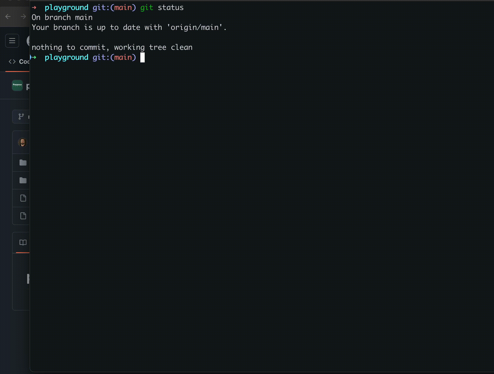

# Release

This script automates creating a release using your local Git. It:

- Selects the branch to release (e.g., `main`)
- Fetches the latest changes
- Compares commits with the target branch
- Prompts for confirmation
- Merges the branch
- Tags and creates a release
- Merges the branch back into the development branch
- Share the changelog via Slack

> Run this script locally; deployment happens on the server after the release is created.

## How to use it?

```txt
./release --help
Usage: release [arguments] [options]

Arguments:
  source-branch        The branch name to release.

Options:
  --debug               Enable debug mode (set -x)
  -d, --dry-run         Simulate the release process without making any changes
  -f, --force           Ignore that your current local branch has ahead commits
  -h, --help            Print Help (this message) and exit
  -v, --version         Print version information and exit
  --source branch       Specify the source branch
  --target branch       Specify the target branch (default: "prod")
  --develop branch      Specify the develop branch (default: source-branch)

Examples:
  release main
  release main --dry-run
  release fix/... --force
  release fix/... --dry-run --force
```

## Demo

### Using --dry-run



### Creating a new release


## Env variables

### RELEASE_SUCCESSFUL_TEXT

Display a text at the very end of the release.
Useful to have a link directly to the releases page to validate everything was good.

> Example: RELEASE_SUCCESSFUL_TEXT=https://github.com/Purpose-Green/release/releases

### RELEASE_EXTRA_CONFIRMATION

Force asking for a new dialog when a filepath is found on such a key.
The value is the question forced to be asked. It must be [y/Y] to continue the release.

> Example: RELEASE_EXTRA_CONFIRMATION='{"migrations": "Migrations found! Remember to create a DB backup!"}'

## Development

#### Env

Make sure you have .env ready to use.

```bash
cp .env.dist .env
```

#### Source

- The entry point of the script is `./release`
- The source code is `src/`, split by different script files storing isolated functions.
- You can build the entire project and create a single executable script with `./build.sh`

#### Tests

The tests are inside `tests/`, using [bashunit](https://github.com/TypedDevs/bashunit/).

Use `install-dependencies.sh` to install bashunit inside your `lib/` folder
